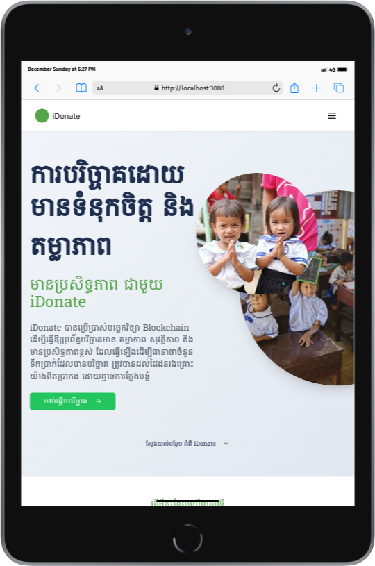
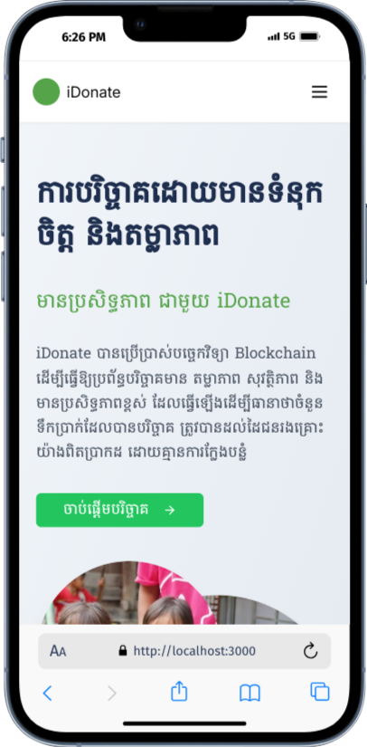

---

# iDonate - Empowering Charitable Giving  

iDonate is a modern, responsive web application designed to facilitate and streamline the process of charitable donations. Our platform connects donors with various causes, providing a user-friendly interface for making contributions and tracking the impact of donations.  

---

## iDonate Page Preview Home Page  
<div style="display: flex; justify-content: center; gap: 10px; padding: 10px;">
   
   
   
</div>


---

## Features  

- 🌐 **Responsive Design**: Optimized for desktop, tablet, and mobile devices.  
- 🎯 **Current Donations Display**: Showcases active donation campaigns.  
- 🌍 **Multi-language Support**: Primary support for Khmer language.  
- 🔒 **User Authentication**: Secure login and registration system.  
- 💸 **Donation Management**: Easy-to-use interface for making and managing donations.  
- 📊 **Real-time Updates**: Live tracking of donation amounts and donor counts.  
- ♿ **Accessibility**: Designed with web accessibility standards in mind.  

---

## Deployment  

The project is currently deployed on Vercel and can be accessed at:  
[🚀 Live Demo: https://idonate-eight.vercel.app/](https://idonate-eight.vercel.app/)  

---

## Technologies Used  

### Frontend  
- ⚛️ React.js  
- 📦 Next.js (App Router)  
- 🎨 Tailwind CSS  
- 🧩 shadcn/ui components   

### Authentication  
- 🔑 NextAuth.js  

### Deployment  
- 📡 Vercel  

---

## Pages and Routes  

### **Public Pages**  
- 🏠 **Home Page**: Provides an overview of iDonate’s mission, current campaigns, and features.  
- 🔑 **Login**: [https://idonate-eight.vercel.app/auth/login](https://idonate-eight.vercel.app/auth/login)  
- 📝 **Sign Up**: [https://idonate-eight.vercel.app/auth/sign-up](https://idonate-eight.vercel.app/auth/sign-up)  
- 🔍 **Search**: [https://idonate-eight.vercel.app/search](https://idonate-eight.vercel.app/search) - Find donation campaigns or organizations.  
- 🎉 **Events**: [https://idonate-eight.vercel.app/events](https://idonate-eight.vercel.app/events) - View upcoming events and causes you can support.  
        To better showcase the subroutes for **Events**, **Contributors**, and **About**, the structure can be improved with clear organization. Here's an updated version with subroutes clearly defined:

---

### **Public Pages with Subroutes**

- 🎉 **Events**:  
  View upcoming events and causes you can support.  
  - [Categories](https://idonate-eight.vercel.app/categories): Browse events by category.  
  - [Organizations](https://idonate-eight.vercel.app/organizations): Discover organizations hosting events.  

- 📜 **About**:  
  Learn about iDonate’s mission and vision.  
  - [About Us](https://idonate-eight.vercel.app/about-us): Detailed information about the team and initiative.  
  - [Mission & Vision](https://idonate-eight.vercel.app/mission-vision): Explore iDonate’s purpose and goals.  

- 📚 **How it Works**: [https://idonate-eight.vercel.app/how-it-works](https://idonate-eight.vercel.app/how-it-works) - A guide on how to use the platform.  

### **After Login Pages**  
- 🤝 **Contributor**: After login, users are directed to their dashboard to track donations, manage campaigns, and view contributions.  
  - 🧍‍♂️ **Donor Dashboard**: [https://idonate-eight.vercel.app/donor-dashboard](https://idonate-eight.vercel.app/donor-dashboard)  
  - 🏢 **Organization Dashboard**: [https://idonate-eight.vercel.app/organization-dashboard](https://idonate-eight.vercel.app/organization-dashboard)  
- ⚙️ **Profile Settings**: Update user information, view donation history, and configure account preferences.  

---

## Getting Started  

### Prerequisites  

- 🖥️ **Node.js**: v22.7.0  
- 📦 **npm**: v10.9.1  

### Installation  

1. **Install Dependencies**:  
   ```bash  
   npm install  
   ```  

2. **Start the Development Server**:  
   ```bash  
   npm run dev  
   ```  

3. **Access Locally**:  
   Open [http://localhost:3000](http://localhost:3000) in your browser.  

---
